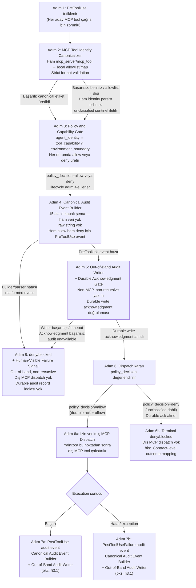

# ADR-007 — Canonical MCP Audit Runtime Architecture

- **ADR-ID:** ADR-007
- **Status:** Proposed
- **Date:** 2026-06-26
- **Owner:** Human maintainer (pending approval)
- **Related controls:** PROJECT_CONSTITUTION.md, CLAUDE.md, AGENTS.md,
  ADR-005-mcp-tooling-control-plane.md,
  ADR-006-mcp-audit-logging-and-runtime-enforcement.md,
  docs/decisions/MCP_AUDIT_EVENT_CONTRACT.md,
  docs/decisions/MCP_AGENT_CAPABILITY_MATRIX.md,
  docs/quality/security-reports/SEC-ADR-005-MCP-CONNECTION-PRECONDITIONS.md,
  docs/handoffs/REQ-001.md,
  docs/handoffs/REQ-002.md

---

## Context

ADR-005 ve ADR-006, MCP (Model Context Protocol) entegrasyonları için sırasıyla
bir politika kontrol modeli ve bir audit logging/runtime enforcement teknik tasarımı
kabul etti. Bu kararlar şu temeli oluşturdu:

- **ADR-005 (Accepted, 2026-06-25):** MCP tooling control-plane politikası;
  read-only-by-default ilkesi, canonical source of truth hiyerarşisinin korunması,
  untrusted MCP output ilkesi ve üç ayrı trust boundary (runtime hook, CI diff gate,
  MCP tool/data access boundary).
- **ADR-006 (Accepted, 2026-06-25):** MCP audit logging ve runtime enforcement teknik
  tasarımı; 15 alanlı kapalı audit event şeması, PreToolUse-merkezli lifecycle,
  fail-closed/durable write acknowledgment ilkesi, out-of-band ve non-recursive audit
  writer zorunluluğu, tool identity sentinel modeli ve beş bağlayıcı security gate.
- **MCP_AUDIT_EVENT_CONTRACT.md:** 15 alanlı kapalı audit event payload şeması ve
  normatif enum'lar; ADR-006 ile birlikte insan maintainer tarafından kabul edilmiştir.
- **SEC-ADR-005-MCP-CONNECTION-PRECONDITIONS.md:** Gerçek MCP bağlantısından önce
  kapatılması gereken güvenlik ön koşulları. Bu tarihte yalnızca ADR-005 insan
  maintainer acceptance'ı kapatılmış; diğer tüm zorunlu kapılar açık kalmaktadır.

Bu arka plan üzerine iki ayrı requirement doğrulama süreci tamamlandı:

- **REQ-001 (Accepted, 2026-06-25):** Offline sentetik lifecycle validasyonu. 158 test,
  OK sonucu. Canonical tool identity sınıflandırmasını, 15 alanlı kapalı şema uyumunu,
  `unclassified` sentinel modelini ve `operation_reference` collision-resistance'ını
  sentetik olarak doğruladı. Gerçek MCP hook davranışını, gerçek MCP bağlantısını
  veya herhangi bir No-Go kapısını kapatmadı.

- **REQ-002 (Accepted, 2026-06-26):** Disposable local workspace üzerinde, yalnızca
  built-in `Read` aracı için non-canonical, sanitised 7 alanlı runtime evidence üretimi.
  PreToolUse hook'unun built-in `Read` için tetiklendiğini ve fail-closed davranışının
  yerel ortamda gözlemlendiğini doğruladı. Canonical `MCP_AUDIT_EVENT_CONTRACT.md`
  kapsamındaki 15 alanlı MCP audit event üretmedi, gerçek MCP tool çağrısını
  doğrulamadı ve herhangi bir No-Go kapısını kapatmadı.

Bu iki aşama tamamlandı; ancak canonical MCP audit runtime'ın mimari bileşen
sınırları, lifecycle sırası, audit sink teknik kriterleri ve açık/kapalı kararların
ayrımı tek bir ADR'de bileşen düzeyinde netleştirilmemiştir. ADR-007 bu boşluğu
kapatmak için oluşturulmaktadır.

---

## Problem

REQ-001 ve REQ-002 sonrasında şu teknik boşluklar geçerliliğini sürdürmektedir:

**1. MCP ile built-in araç ayrımı bileşen düzeyinde netleştirilmemiştir.**
REQ-002, built-in `Read` için non-canonical evidence üretti. Bu kanıtın ne ifade
ettiği ve canonical MCP audit runtime'dan nasıl ayrıştığı — özellikle `unclassified`
sentinel'inin hangi yolda geçerli olduğu ve built-in araçların neden bu sistemin
dışında kaldığı — tek bir bileşen referansında tanımlanmamıştır.

**2. Mimari bileşenler adlandırılmamış ve sınırları belirsizdir.**
ADR-006 davranışsal ilkeleri tanımladı; ancak "hangi bileşen hangi sorumluluğu
üstlenir, hangi girdi/çıktıyı işler ve hangi sınırın dışına çıkamaz" sorusuna
adlandırılmış bileşenler düzeyinde yanıt vermedi. Gerçek MCP connection için
canonical audit runtime'ın implementasyonu, bu bileşen sınırlarını bir referans
olarak gerektirmektedir.

**3. Audit sink teknik kriterleri somutlaştırılmamıştır.**
ADR-006 §12'nin "append-only veya tamper-evident olmalı" bağlayıcı gereksinimi
mevcuttur; ancak seçilecek çözümün karşılaması gereken asgari teknik kriterler
(durable write acknowledgment kapasitesi, out-of-band erişilebilirlik, kapalı
şema uyumu, non-recursive erişim) bileşen mimarisi perspektifinden ayrıca
tanımlanmamıştır.

**4. Açık ve kapalı kararların sınırı bileşen perspektifinden özetlenmemiştir.**
ADR-006 "Open Questions" bölümünde bazı konular açık olarak işaretlenmiş; ancak
"gerçek MCP bağlantısından önce kesinlikle tasarlanması gereken" ile "gerçekten
ileri tarihli teknik seçim" olan sorular, bileşen mimarisi perspektifinden tek
bir yerde organize edilmemiştir.

Bu ADR yalnızca **mimari bileşen tanımlaması, lifecycle netleştirmesi ve audit
sink teknik kriterlerinin belirlenmesi**dir. Hiçbir MCP server kurmaz, audit
logger implemente etmez, sink seçmez veya gerçek bağlantı açmaz.

---

## Decision

Agentic DevFlow OS için **Canonical MCP Audit Runtime Architecture** tanımlanır.
Bu ADR, ADR-005 ve ADR-006'nın kurduğu teknik tasarımı altı adlandırılmış
mantıksal bileşen ve netleştirilmiş lifecycle sırası ile bütünleştirir.

### 1. Kapsam Sınırı: Yalnızca Gerçek MCP Tool Çağrıları

Bu ADR'de tanımlanan canonical audit runtime **yalnızca gerçek MCP tool
çağrılarına** uygulanır. Bu sınır ADR-006 §1 ile tutarlıdır ve ADR-007
tarafından bileşen düzeyinde tescil edilmektedir.

**Kapsam dışında olanlar:**

- **Claude Code'un built-in araçları** (`Read`, `Write`, `Edit`, `Bash`, `Glob`,
  `Grep` vb.): Bu araçlar ADR-001/ADR-003'ün runtime hook'u ve ADR-004'ün CI
  diff gate'i kapsamındadır. Bu araçlar için canonical MCP audit event **üretilmez
  ve üretilmesi beklenmez**.
- **REQ-002'nin non-canonical, sanitised 7 alanlı runtime evidence kaydı:** Bu
  kayıt yalnızca built-in `Read` için disposable local spike ortamında üretilmiş
  bir evidence modelidir. `MCP_AUDIT_EVENT_CONTRACT.md`'deki 15 alanlı kapalı
  şemayı karşılamaz ve karşılamaya çalışmaz; canonical MCP audit event'i değildir,
  onun yerine geçmez ve onun doğrulaması sayılmaz.

**`unclassified` sentinel sınırı (bağlayıcı):** `unclassified` sentinel değeri
(`mcp_server: "unclassified"`, `mcp_tool: "unclassified"`) **yalnızca** gerçek
bir MCP tool kimliği alınıp local allowlist/map üzerinden sınıflandırılamadığında
geçerlidir. Built-in araçlar için bu sentinel **kullanılmaz**; built-in araçlar
bu bileşen zincirinden geçmez.

### 2. Mimari Bileşenler

Canonical MCP audit runtime altı adlandırılmış mantıksal bileşenden oluşur. Bu
bileşenler kavramsal sorumluluk sınırlarıdır; somut implementasyon şekli (tek
process, birden çok module, library, daemon vb.) bu ADR kapsamında seçilmez —
bu, §6 Açık Teknik Kararlar altında kayıtlıdır.

---

#### 2.1 MCP Tool Identity Canonicalizer

**Sorumluluk:** Runtime'dan gelen ham MCP server/tool kimliğini, local
allowlist/map üzerinden strict format validation ile canonical ve güvenli bir
etikete dönüştürmek.

**Sınırlar:**

- Runtime'dan gelen ham `mcp_server`/`mcp_tool` string'ini hiçbir koşulda
  persist etmez, audit event alanına yazmaz, denial yoluna eklemez veya
  Human-Visible Failure Signal'a taşımaz.
- Yalnızca `MCP_AGENT_CAPABILITY_MATRIX.md`'de tanımlı allowlist/map içindeki
  canonical, lowercase ASCII etiket (`^[a-z0-9][a-z0-9._-]{0,63}$`, en fazla
  64 karakter) üretebilir.
- Sınıflandırma kesin biçimde yapılamazsa (belirsiz, allowlist dışı veya
  biçim validation'ı başarısız): `mcp_server: "unclassified"`,
  `mcp_tool: "unclassified"` sabit sentinel değerlerini Policy and Capability
  Gate'e iletir; bu durum fail-closed `deny` sinyali anlamına gelir.
- Built-in araçlar için bu bileşen **çalışmaz**; `unclassified` sentinel yalnızca
  gerçek MCP identity classification başarısızlığı yolunda üretilir.

---

#### 2.2 Policy and Capability Gate

**Sorumluluk:** MCP Tool Identity Canonicalizer'dan gelen canonical kimliği,
`MCP_AGENT_CAPABILITY_MATRIX.md`'deki agent identity, tool capability ve
environment boundary üçlü koşuluyla değerlendirerek `allow` veya `deny` kararı
üretmek.

**Sınırlar:**

- Bu kararı Canonical Audit Event Builder'dan ve Durable Acknowledgment Gate'ten
  **bağımsız** olarak üretir. Yani audit yazımının başarısı bu kararı belirlemez;
  tersine, bu kararın `allow` ya da `deny` olması, audit event'inin `policy_decision`
  alanını belirler.
- Aşağıdaki üç koşuldan biri sağlanmazsa karar zorunlu olarak `deny`'dir:
  1. Agent identity — çağrıyı yapan agent, ilgili MCP için capability matrix'te
     "Allowed agents" listesinde olmalı.
  2. Tool capability — istenen aksiyon, o MCP için tanımlı "Default permission"
     ve "Explicitly prohibited actions" sınırları içinde olmalı.
  3. Environment boundary — aksiyon, o MCP için tanımlı "Environment scope"
     içinde olmalı.
- İzin dışı, belirsiz veya capability matrix'te bulunmayan bir MCP tool çağrısını
  `allow` kararıyla geçirmez.
- Yalnızca `allow` / `deny` kararı üretir; kayıt tutma, depolama veya human
  signal sorumluluğunu taşımaz.

---

#### 2.3 Canonical Audit Event Builder

**Sorumluluk:** ADR-006 ve `MCP_AUDIT_EVENT_CONTRACT.md`'de tanımlı 15 alanlı
kapalı şema ile tam ve geçerli bir audit event yapısı oluşturmak.

**Sınırlar:**

- Yalnızca `MCP_AUDIT_EVENT_CONTRACT.md`'deki 15 alanlı kapalı şemayı üretir;
  bu şemaya yeni alan eklenemez, serbest metin not alanı (`note`, `notes`,
  `message`, `error_message`, `details`, `debug` vb.) **bulunmaz ve eklenemez**.
- Raw tool input/output, prompt içeriği, URL, header, secret, credential, dosya
  yolu, exception text veya herhangi bir serbest metin taşımaz.
- `mcp_server` ve `mcp_tool` alanlarına yalnızca MCP Tool Identity Canonicalizer'dan
  gelen canonical etiket ya da sabit `"unclassified"` sentinel yazılır; ham
  runtime string'i bu alanlara **hiçbir koşulda** yazılamaz.
- REQ-002'nin non-canonical 7 alanlı evidence schema'sıyla karıştırılmaz; bu
  formatı tamamlamak, genişletmek veya dönüştürmek için **kullanılmaz**.
- `audit_record_version` her tekil kayıt revizyonunu izler; `schema_version`
  contract değişikliğini izler ve artışı ayrı bir contract güncelleme kararı
  gerektirir.

---

#### 2.4 Out-of-Band Audit Writer

**Sorumluluk:** Canonical Audit Event Builder'ın ürettiği event'i, gözlemlediği
MCP tool-call mekanizmasından tamamen bağımsız bir yolla audit storage/sink'e
yazmak.

**Sınırlar:**

- Herhangi bir MCP tool'u, MCP sunucusu veya MCP-benzeri mekanizma kullanarak
  yazma işlemi **yapamaz**.
- `PreToolUse`/`PostToolUse` lifecycle zincirini, ya da bu ADR kapsamındaki
  herhangi bir hook event'ini yeniden tetikleyerek yazma işlemi yapamaz.
  Recursive audit/enforcement döngüsü **oluşturmaz** (ADR-006 §13).
- Writer başarısız olduğunda:
  - Dış MCP dispatch'e **izin vermez**.
  - Yalnızca Human-Visible Failure Signal bileşenine sinyal gönderir.
  - Bu sinyal yeni bir MCP çağrısı başlatmaz ve audit zincirini yeniden
    tetiklemez.
- Audit sink'e yazma işleminin durable write acknowledgment'ını aldığını
  Durable Acknowledgment Gate'e bildirmeden önce, bu acknowledgment'ın
  audit sink'in integrity/durability modeline uygun biçimde tamamlandığını
  doğrular.
- Somut sink teknolojisi, storage konumu ve transport mekanizması bu ADR'de
  seçilmez (bkz. §4 Audit Sink Teknik Kriterleri ve §6 Açık Teknik Kararlar).

---

#### 2.5 Durable Acknowledgment Gate

**Sorumluluk:** `PreToolUse` canonical audit event'in Out-of-Band Audit Writer
tarafından audit sink'e durable biçimde yazılıp yazılmadığını doğrulayarak dış
MCP dispatch'e izin verip vermeyeceğine karar vermek.

**Sınırlar:**

- Bu gate **yalnızca bir availability ping değildir.** Gerçek gate, o spesifik
  `PreToolUse` event'inin audit sink'in integrity/durability modeline uygun
  biçimde yazıldığının **durable write acknowledgment'ı**dır. Sink'in "çalışıyor"
  olması tek başına yeterli değildir (ADR-006 §15 TOCTOU Kapanışı).
- Acknowledgment alınmadan dış MCP dispatch **hiçbir koşulda başlamaz**.
- Best-effort, optimistic veya asenkron yazım bu gate için **kabul edilmez**.
- Acknowledgment başarısızlığı:
  - Out-of-Band Audit Writer'a hata sinyali gönderir.
  - Policy and Capability Gate'in `allow` kararı bu noktada **geçersiz** kalır.
  - Dış dispatch yapılmaz.
  - Human-Visible Failure Signal tetiklenir.

---

#### 2.6 Human-Visible Failure Signal

**Sorumluluk:** Herhangi bir hata durumunda (identity classification başarısızlığı,
policy deny, audit writer başarısızlığı, acknowledgment başarısızlığı) insan
maintainer'ın inceleyebileceği, secret/PII içermeyen bir bildirim üretmek.

**Sınırlar — bu kısıtlar kapalı tanımdır (ADR-006 §6a ile aynı anlamda,
bileşen düzeyinde tescil edilmiştir):**

- Canonical audit event payload'ının **ek bir alanı değildir**; 15 alanlı kapalı
  şemaya yeni alan eklemez ve bu şemanın bir parçası olarak modellenmez.
- Out-of-band ve non-recursive bir bildirimdir; audit sink'in kendisi veya yazma
  zinciri üzerinden taşınmaz.
- Yalnızca **locally controlled sabit şablonlar** ve `MCP_AUDIT_EVENT_CONTRACT.md`'de
  tanımlı **kapalı `failure_category` enum değerleri** üzerinden üretilir. Serbest
  metin üretimi yoktur; raw tool identity, raw exception text, prompt, URL, token,
  secret veya PII taşımaz.
- Yeni bir MCP çağrısı **başlatmaz**; herhangi bir audit event'ini yeniden
  tetiklemez; Out-of-Band Audit Writer'ı recursive biçimde çağırmaz.
- İnsan onayı veya capability validation kanıtının yerine **geçmez**; bu sinyal
  yalnızca failure durumunu bildirmek içindir.
- Bu signal'in **nerede/nasıl gösterileceği** (terminal çıktısı, local dosya,
  ayrı uyarı kanalı vb.) seçilmez; bu §6 Açık Teknik Kararlar altındadır.
  Ancak yukarıdaki beş içerik kısıtı açık bir soru değildir; bunlar bağlayıcı
  tasarım kurallarıdır.

---

### 3. Canonical MCP Audit Lifecycle

Aşağıdaki sekiz adım, canonical MCP audit runtime'ın zorunlu ve sıralı
gerçekleşme düzenini tanımlar. Adım numaraları yaşam döngüsü sırasını gösterir.
Adım 4 veya 5'te hata oluştuğunda akış adım 8'e (pre-dispatch deny/blocked +
Human-Visible Failure Signal) gider ve dış MCP dispatch gerçekleşmez. Policy
deny kararı adım 3'te belirlense de terminal deny adım 6b'de, audit event
durable write acknowledgment alındıktan sonra gerçekleşir.

**Adım sırası:**

1. **MCP candidate call alınır.** `PreToolUse` event tetiklenir. Bu event, bu
   lifecycle'ın zorunlu başlangıç noktasıdır; her aday MCP tool çağrısı için
   oluşması beklenir.
2. **Canonical identity sınıflandırması yapılır.** MCP Tool Identity Canonicalizer,
   runtime'dan gelen ham `mcp_server`/`mcp_tool` kimliğini local allowlist/map
   üzerinden strict format validation ile sınıflandırır. Sınıflandırma başarısızsa
   veya allowlist dışıysa ham identity hiçbir koşulda persist edilmez; yalnızca
   `mcp_server: "unclassified"`, `mcp_tool: "unclassified"` sentinel değerleri
   Policy and Capability Gate'e iletilir.
3. **Policy/capability kararı verilir.** Policy and Capability Gate, canonical kimliği
   `MCP_AGENT_CAPABILITY_MATRIX.md` üzerinden agent identity, tool capability ve
   environment boundary koşullarına göre değerlendirerek her durumda `allow` veya
   `deny` kararı üretir. `unclassified` sentinel iletilmişse bu koşul zorunlu `deny`
   kararı üretir. Adım 2'deki classification başarısızlığı veya policy koşullarının
   karşılanmaması bu adımda `deny` kararını belirler; her iki durumda da lifecycle
   adım 4'e ilerler.
4. **PreToolUse canonical audit event hazırlanır.** Canonical Audit Event Builder,
   policy kararı `allow` veya `deny` olsun, 15 alanlı kapalı şemayı kullanarak
   ham veri içermeyen, yalnızca yapısal/sınıflandırma alanları taşıyan güvenli
   bir PreToolUse audit event oluşturur. Builder hatası, parser hatası veya
   malformed event oluşursa → **dış dispatch başlamadan deny/blocked +
   Human-Visible Failure Signal** (Adım 8).
5. **Out-of-Band Audit Writer durable write acknowledgment doğrular.** Out-of-Band
   Audit Writer, bu PreToolUse event'ini non-MCP ve non-recursive bir yolla audit
   sink'e yazar; Durable Acknowledgment Gate, bu PreToolUse event'i için yazımın
   audit sink'in integrity/durability modeline uygun biçimde tamamlandığını doğrular.
   Writer başarısız olursa, timeout veya acknowledgment başarısızlığı yaşanırsa →
   **dış dispatch başlamadan deny/blocked + Human-Visible Failure Signal** (Adım 8).
6. **Dispatch kararı.** Durable write acknowledgment başarıyla tamamlandıktan sonra
   policy kararı değerlendirilir: `policy_decision = allow` ise dış MCP tool dispatch
   edilir; `policy_decision = deny` ise durable acknowledgment alındıktan sonra dış
   MCP dispatch gerçekleşmeden terminal deny/blocked üretilir. Contract-level outcome
   koşula bağlıdır: identity classification başarısızlığı (unclassified) → `outcome:
   "blocked"`; canonical identity mevcut ancak policy/capability reddi → `outcome:
   "denied"` (bkz. `### Contract-level outcome mapping`). Dispatch adım 5'teki
   durable write acknowledgment'tan önce **gerçekleşemez**.
7. **PostToolUse veya PostToolUseFailure audit event üretilir.** Yalnızca adım 6'da
   `policy_decision = allow` ile dispatch gerçekleşmişse, execution sonucuna göre
   Canonical Audit Event Builder `PostToolUse` (başarı) veya `PostToolUseFailure`
   (gerçek execution başladıktan sonra hata/exception) audit event'i oluşturur;
   Out-of-Band Audit Writer bu event'i de durable biçimde yazmaya çalışır. Bu
   adıma özgü yazma/acknowledgment başarısızlıkları için bkz. §3.1.
8. **Pre-dispatch hata → dispatch gerçekleşmeden deny/blocked + Human-Visible Failure
   Signal.** Adım 4 veya 5'te oluşan herhangi bir başarısızlık (builder hatası,
   parser hatası, malformed event, writer başarısızlığı, timeout, acknowledgment
   başarısızlığı) dış MCP dispatch operasyonel olarak bloklanır ve Human-Visible
   Failure Signal tetiklenir. Bu hata yolunda başarılı durable canonical audit record
   üretildiği iddia edilmez; `outcome: "blocked"` içeren persisted canonical record
   oluştuğu izlenimini verilmez.

**Lifecycle Diyagramı (Mermaid):**

**Diyagram notları:**

- `PermissionRequest` event'i yukarıda ayrıca gösterilmemiştir; ADR-006 §2 ile
  tutarlı olarak bu event koşulludur — her MCP çağrısında zorunlu değildir ve
  yalnızca Claude Code kullanıcıya/konfigürasyona bir permission dialog gösterecekse
  ortaya çıkar.
- `PermissionDenied` outcome'u, adım 3'te belirlenen policy deny kararının adım
  6b'deki terminal deny/blocked sonucuna ya da permission dialog reddine eşlenir;
  `PostToolUse`/`PostToolUseFailure` bu dalda üretilmez.
- Durable write başarıyla tamamlanan pre-dispatch dallar `operation_reference` ile
  ilişkilendirilen canonical audit record ile sonuçlanır. Out-of-Band Audit Writer
  veya Durable Acknowledgment Gate unavailable olduğunda başarılı durable audit
  record üretildiği iddia edilmez; bu durumda dış MCP dispatch kesinlikle başlamaz
  ve yalnızca locally controlled, fixed-template, non-recursive Human-Visible Failure
  Signal üretilir. Signal başarısızlığı da dispatch için izin oluşturmaz ve bu
  signal canonical 15 alanlı payload'a yeni alan eklemez.
- `timestamp` tek başına total ordering kanıtı değildir; paralel çağrılarda
  lifecycle bütünlüğü `operation_reference` üzerinden izlenir (ADR-006 §7).

---

### Contract-level outcome mapping

Aşağıdaki eşleştirme, lifecycle adımlarında kullanılan `deny`, `blocked`,
`denied`, `failure` ve `success` operasyonel terimlerini
`MCP_AUDIT_EVENT_CONTRACT.md`'deki normatif enum değerleriyle koşullu ve kesin
biçimde ilişkilendirir. Yeni field, enum, failure category veya contract değişikliği
içermez.

#### 1. Unclassified gerçek MCP identity

Yalnızca gerçek MCP identity classification failure yolunda geçerlidir.

- `policy_decision: "deny"`
- `outcome: "blocked"`
- `failure_category: "unclassified_tool_identity"`

Bu mapping, yalnızca ilgili `PreToolUse` canonical event için durable write
acknowledgment başarıyla alınmışsa persisted canonical record üzerinde kullanılır.
Writer veya durable acknowledgment unavailable ise başarılı durable record yazıldı
iddia edilmez; dış MCP dispatch yine de başlamaz.

#### 2. Canonical identity mevcut, policy veya capability reddi

- `policy_decision: "deny"`
- `outcome: "denied"`
- `failure_category` yalnızca mevcut contract enum'larından seçilir:
  - `capability_mismatch`: agent identity, tool capability veya environment scope uyuşmazlığı
  - `policy_violation`: explicitly prohibited action veya açık policy kuralı ihlali

Durable acknowledgment başarıyla alınmışsa terminal deny operasyonel olarak
gerçekleşir ve canonical event yukarıdaki exact enum mapping ile temsil edilir.
`blocked`, bu policy/capability rejection yolu için serbest veya eş anlamlı bir
outcome gibi yazılmaz.

#### 3. Policy allow ve başarılı execution

- `policy_decision: "allow"`
- `outcome: "success"`
- `failure_category: null`

Bu mapping başarılı execution sonrasındaki `PostToolUse` event'i için geçerlidir.

#### 4. Policy allow ve execution başladıktan sonra tool error

- `policy_decision: "allow"`
- `outcome: "failure"`
- `failure_category: "tool_error"`

Bu mapping `PostToolUseFailure` event'i için geçerlidir.

#### 5. Pre-dispatch audit unavailable

Audit writer, parser, malformed event, timeout veya durable acknowledgment failure
durumunda dış MCP dispatch operasyonel olarak bloklanır. Başarılı durable canonical
audit record varmış gibi iddia edilmez. Bu nedenle `outcome: "blocked"` içeren
persisted canonical record oluştuğu izlenimini verilmez. Yalnızca fixed-template,
non-recursive Human-Visible Failure Signal üretilir. Signal canonical payload'a yeni
field veya enum eklemez.

#### 6. Post-dispatch audit persistence failure

Dispatch zaten gerçekleştiği için rollback, cancel veya retroactive deny yoktur.
Başarılı persisted `PostToolUse` veya `PostToolUseFailure` event'i varmış gibi iddia
edilmez. Bu durum audit-integrity incident olarak kalır. Yeni canonical outcome veya
yeni failure category eklenmez.

---

### 3.1 Post-dispatch audit persistence failure boundary

PostToolUse veya PostToolUseFailure event'i için Out-of-Band Audit Writer veya
Durable Acknowledgment Gate başarısız olduğunda aşağıdaki sınırlar geçerlidir:

- MCP dispatch bu noktada zaten gerçekleşmiştir; bu hata geriye dönük deny,
  cancel, rollback veya "dispatch hiç olmadı" iddiası oluşturmaz.
- Bu durum **audit-integrity incident** olarak ele alınır.
- Runtime yalnızca locally controlled, fixed-template, non-recursive Human-Visible
  Failure Signal üretir.
- Telafi amaçlı yeni MCP çağrısı, yeni tool dispatch veya recursive audit çağrısı
  başlatılmaz.
- Sonraki MCP candidate call'ları kendi normal PreToolUse fail-closed lifecycle'ından
  geçmek zorundadır; kendi durable write acknowledgment'ı olmadan dispatch edilmez.
- Incident escalation, recovery/unblock prosedürü, human review ve storage/
  implementation ayrıntıları açık teknik karar olarak kalır (bkz. §6).
- Post-dispatch incident state canonical 15 alanlı payload'a yeni alan eklemez ve
  yeni enum icat etmez.

---

### 4. Audit Sink Teknik Kriterleri

Bu ADR audit sink teknolojisi, vendor veya storage konumu **seçmez**. Ancak
seçilecek çözümün gerçek MCP bağlantısından önce karşılaması gereken **asgari
teknik kriterleri** aşağıda tanımlar. İnsan maintainer, capability validation
sürecinde bu kriterlerin karşılandığını ayrıca doğrulamalıdır (ADR-006 §12).

**Kriter 1 — Append-only veya tamper-evident depolama:**
Bir audit kaydı yazıldıktan sonra yetkisiz silme, değiştirme veya retroaktif
eksiltmeye karşı teknik bir kontrol bulunmalıdır. Kabul edilebilir mekanizma
sınıfları şunlardır (ancak bu liste somut seçim yapmaz): append-only storage,
hash-chain, WORM storage veya eşdeğer bir tamper-evidence mekanizması. Hangi
mekanizmanın kullanılacağı §6'daki açık teknik karar olarak kayıtlıdır.

**Kriter 2 — Durable write acknowledgment kapasitesi:**
Sink, bir event yazıldıktan sonra Durable Acknowledgment Gate'in ihtiyaç
duyduğu biçimde — yalnızca erişilebilirlik ping'i değil, gerçek write
durabilityini teyit eden — bir acknowledgment üretebilmelidir. Yalnızca
"kayıt başarıyla alındı" değil, "kayıt bu sink'in integrity modeline uygun
biçimde yazıldı" guarantisi sağlanmalıdır.

**Kriter 3 — Out-of-band erişilebilirlik:**
Out-of-Band Audit Writer, audit sink'e MCP mekanizması kullanmadan ve mevcut
`PreToolUse`/`PostToolUse` lifecycle'ını yeniden tetiklemeden ulaşabilmelidir.
Sink'e erişim yolu, canonical MCP audit lifecycle'ının kendisinden bağımsız
olmalıdır.

**Kriter 4 — Kapalı şema uyumu:**
Sink, tam olarak 15 alanlı payload'u alabilmeli; ek serbest metin alanı
eklemeye zorlamamalı; yasak veri tiplerini (raw tool input/output, prompt, URL,
header, token, secret, PII, exception text) accept etmemeli veya ihtiyaç
duymadığını açıkça ortaya koymalıdır.

**Kriter 5 — Secret-bearing olmayan access modeli:**
Audit kayıtları secret, credential veya PII içermemelidir. Storage erişimi
insan maintainer onayı olmadan herkese açık veya geniş kapsamlı olmamalıdır.
Erişim kontrolü en az ayrıcalık (least-privilege) ilkesiyle uyumlu olmalıdır.

**Kriter 6 — Non-recursive erişim:**
Sink'e yazma işlemi, Durable Acknowledgment Gate'in bekleme döngüsünde ya da
herhangi bir hook handler içinde recursive biçimde yeni bir MCP audit event
oluşturmamalıdır. Audit writer'ın sink'e yazma girişimi, kendi izleme zincirinin
yeniden tetiklenmesine yol açmamalıdır.

**Kriter 7 — Retention mekanizması:**
Audit kayıtlarının ne kadar süreyle saklanacağı insan maintainer tarafından
belirlenmeli; sink bu süreyi teknik olarak uygulatabilmelidir. Planlı retention
silme işlemleri (retention süresi dolumu), yetkisiz/sessiz silme/değiştirmeden
ayrı bir yetkilendirme adımı gerektirir (ADR-006 §12). Retention süresi bu
ADR'de seçilmez; §6'daki açık teknik karar olarak kayıtlıdır.

---

### 5. Kesin Sınırlar

Bu ADR aşağıdaki işlemleri **açıkça yapmaz ve yapması beklenmez:**

- Gerçek bir MCP server'a bağlanmaz; credential, token, API key veya endpoint
  kullanmaz ya da seçmez.
- Production hook, persistent `.claude/settings.json` konfigürasyonu veya
  `.claude/hooks/` değişikliği oluşturmaz.
- Audit sink teknolojisi, vendor, storage konumu veya transport mekanizması
  seçmez ya da implemente etmez.
- `SEC-ADR-005-MCP-CONNECTION-PRECONDITIONS.md`'deki "Bağlantı Öncesi Zorunlu
  Kapılar" listesindeki hiçbir checkbox'ı kapatmaz.
- REQ-002'nin non-canonical runtime evidence'ının canonical MCP audit event
  doğrulaması olduğunu iddia etmez; bu handoff'un kapsamını genişletmez.
- Human maintainer acceptance olmadan — yani bu ADR "Proposed"dan "Accepted"a
  insan kararıyla geçmeden — herhangi bir implementation başlatılamaz.
- Bu ADR'nin kabulü gerçek MCP bağlantısını otomatik olarak yetkilendirmez;
  ADR-005/ADR-006/SEC-ADR-005 kapsamındaki tüm kapılar ve §6'daki Açık Teknik
  Kararlar ayrıca tamamlanmalıdır.

---

## Alternatives Considered

### 1. Hook'un doğrudan repository içindeki sıradan JSON dosyasına yazması

**Açıklama:** PreToolUse hook, audit event'i doğrudan Git-tracked repository'deki
bir JSON dosyasına (örneğin `docs/audit/` altında) append eder.

**Değerlendirme:**

- **Durability/tamper-evidence:** Git-tracked dosya, append-only bir storage
  değildir; `git reset`, `git commit --amend`, `git rebase` veya `git checkout`
  geçmişi geri yazabilir. ADR-006 §12'nin "tamper-evident" bağlayıcı kriteri
  **karşılanmaz**.
- **Secret minimization:** Git history audit kayıtlarını kalıcı ve geri
  döndürülemez biçimde içerir; bir sızıntı tüm geçmişi etkiler. PROJECT_CONSTITUTION.md
  §6 ile çelişir.
- **Non-recursive risk:** `Write` araç çağrısı ADR-001/ADR-003 runtime hook'unun
  kapsamına girer; bu durum audit yazma adımının kendi başına bir hook event'i
  üretme ve recursive döngü oluşturma riskini barındırır.
- **Fail-closed:** Dosya yazma başarısız olduğunda MCP dispatch durdurulabilir;
  ancak başarılı olduğunda CI diff gate tetikleyebilir ve audit kayıtlarının
  ownership manifest kapsamına girip girmeyeceği belirsiz kalır.
- **Karar: Reddedildi.** Tamper-evidence eksikliği, Git-history kalıcılık riski,
  non-recursive guarantee'nin karmaşıklığı ve CI diff gate çakışması bu
  yaklaşımı kabul edilemez kılar.

---

### 2. Hook'un MCP üzerinden audit writer çağırması

**Açıklama:** Audit yazma işlemi kendisi de bir MCP tool call olarak tasarlanır;
örneğin ayrı bir "audit-writer MCP server" audit event'lerini alır.

**Değerlendirme:**

- **Recursion:** Bu yaklaşım, audit yazımının kendi kendini tetikleyen sonsuz
  bir recursive döngü oluşturmasına doğrudan yol açar: audit MCP çağrısı →
  PreToolUse hook → yeni audit yazımı → ... ADR-006 §13 Out-of-Band ve
  Non-Recursive ilkesi bu yapıyı açıkça ve bağlayıcı biçimde yasaklar.
- **Sonsuz regres:** Audit MCP server'ının kendisi de audit edilmesi gerektiğinde
  problem çözülemez hale gelir; bu mimari olarak bozuk bir tasarımdır.
- **Fail-closed:** Audit MCP server erişilemez olduğunda MCP dispatch durdurulabilir;
  ancak bu kontrol mekanizmasının kendisi MCP üzerinden çalışıyorsa aynı erişim
  sorununa maruz kalır.
- **Secret minimization:** MCP üzerinden geçen audit event'i, untrusted MCP output
  ilkesi (ADR-005) kapsamında bir payload haline gelir; audit içeriğinin güven
  zinciri zayıflar.
- **Karar: Reddedildi.** Recursion ve sonsuz regres problemi bu yaklaşımı mimari
  olarak bozuk kılar; ADR-006 §13 bu kararı bağlayıcı biçimde kapatmaktadır.

---

### 3. Best-effort / asenkron audit yazımı ile dispatch'in devam etmesi

**Açıklama:** Audit event yazımı asenkron ve best-effort olarak yapılır; yazım
tamamlanmadan veya acknowledgment alınmadan dış MCP dispatch başlar.

**Değerlendirme:**

- **Fail-closed ihlali:** Bu yaklaşım "audit yoksa aksiyon yok" ilkesini (ADR-006
  §6) doğrudan ihlal eder. Audit yazımı başarısız olsa bile dispatch devam ettiğinden
  fail-closed garantisi sağlanamaz.
- **TOCTOU:** Dispatch başladıktan sonra audit yazımı başarısız olursa çağrı
  audit edilmemiş olarak tamamlanır; güvenlik kanıtı geriye dönük olarak
  boşaltılmış olur.
- **Durability:** Asenkron yazım, hangi audit kaydının hangi çağrıya ait olduğunu
  zaman sırasına göre garanti etmez; özellikle paralel çağrılarda `operation_reference`
  correlation güvenilirliği zayıflar.
- **Karar: Reddedildi.** ADR-006 §6 ("audit yoksa aksiyon yok") ve §15 (TOCTOU
  kapanışı: durable write acknowledgment önce, dispatch sonra) bu yaklaşımı
  bağlayıcı biçimde yasaklamaktadır.

---

### 4. Canonical MCP event yerine REQ-002 tarzı non-canonical runtime evidence kullanımı

**Açıklama:** REQ-002'nin 7 alanlı sanitised evidence schema'sını tüm gerçek MCP
tool çağrıları için audit mekanizması olarak benimsemek.

**Değerlendirme:**

- **Kapsam uyuşmazlığı:** REQ-002 evidence schema'sı yalnızca built-in `Read` için
  tasarlandı ve `hook_event: PreToolUse`, `tool_class: builtin_read` gibi
  MCP-agnostik alanlar taşır. Gerçek MCP tool kimliğini (`mcp_server`, `mcp_tool`),
  agent kimliğini (`agent_type`), `operation_reference`'ı, `policy_decision`'ı,
  `failure_category`'yi veya `audit_record_version`'ı içermez.
- **Contract ihlali:** `MCP_AUDIT_EVENT_CONTRACT.md`'deki 15 alanlı kapalı şema
  ADR-006 ile birlikte insan maintainer tarafından kabul edilmiştir. Bu şemanın
  yerini başka bir schema alması için ayrı bir contract güncellemesi ve insan onayı
  gerekirdi.
- **Forensic yetersizlik:** 7 alanlı schema, lifecycle bütünlüğü (`operation_reference`
  correlation), policy kararı traceability ve `failure_category` taksonomisi gibi
  güvenlik ve audit değeri taşıyan alanları içermez.
- **Karar: Reddedildi.** REQ-002 evidence schema'sı disposable local spike için
  tasarlanmış bir non-canonical modeldir; gerçek MCP audit için ADR-006 ve insan
  maintainer tarafından kabul edilen 15 alanlı kapalı şema geçerlidir.

---

### 5. Durable audit acknowledgment ile bağımsız out-of-band writer yaklaşımı (seçilen model)

**Açıklama:** Audit yazımı, gözlemlediği MCP lifecycle'dan tamamen bağımsız bir
out-of-band mekanizma ile yapılır. Durable write acknowledgment alınmadan dispatch
gerçekleşmez.

**Değerlendirme:**

- **Fail-closed:** Out-of-Band Audit Writer başarısız olduğunda dispatch
  durdurulur; "audit yoksa aksiyon yok" ilkesi (ADR-006 §6) korunur.
- **Non-recursive:** Audit writer MCP kullanmaz; PreToolUse/PostToolUse zincirini
  yeniden tetiklemez; recursive döngü oluşmaz (ADR-006 §13).
- **TOCTOU kapanışı:** Durable Acknowledgment Gate, dispatch'ten önce kapanır;
  TOCTOU riski giderilir (ADR-006 §15).
- **Secret minimization:** Audit writer ham MCP output'u işlemez; yalnızca 15
  alanlı kapalı şemayı alır; secret/PII sızıntı yüzeyi minimaldır.
- **Durability:** Sink §4'teki teknik kriterleri karşıladığında, acknowledgment
  garantisi gerçek bir durability sağlar ve tamper-evidence kriteri korunur.
- **Karar: Bu ADR'nin seçilen mimari modelidir.** Bu yaklaşım ADR-006'nın §6,
  §13, §15 bağlayıcı gate'leriyle uyumludur. Bu ADR bu modeli altı adlandırılmış
  bileşen ve lifecycle sırası düzeyinde tescil eder.

---

## Open Technical Decisions (Açık Teknik Kararlar)

Aşağıdaki kararlar bu ADR kapsamında alınmamıştır ve gerçek MCP bağlantısından
önce ayrıca tasarlanıp insan maintainer tarafından onaylanmalıdır. Bu liste
ADR-006 "Open Questions" bölümüyle tutarlıdır ve bileşen mimarisi perspektifinden
organize edilmiştir.

1. **Append-only veya tamper-evident sink teknolojisi:** §4 Kriter 1'in karşıladığı
   somut storage teknolojisi, vendor veya mekanizma (hash-chain, WORM storage vb.)
   seçilmemiştir. Seçim insan maintainer onayı gerektirir (ADR-006 §9, §12).

2. **Storage konumu, retention süresi ve human review modeli:** Audit kayıtlarının
   nerede saklanacağı, ne kadar süreyle tutulacağı, kim tarafından ve hangi sıklıkla
   gözden geçirileceği belirlenmemiştir. Tüm bu kararlar insan maintainer onayı
   gerektirir (ADR-006 §9).

3. **Out-of-Band Audit Writer'ın somut process/service sınırı:** Writer'ın ayrı bir
   OS process, library call, Unix domain socket üzerinden çalışan bağımsız bir
   daemon veya başka bir mekanizma olarak hayata geçirileceği seçilmemiştir.

4. **Writer'ın OS-level permission modeli:** Audit writer'ın hangi OS kullanıcısı
   veya servis hesabı kimliğiyle çalışacağı, audit sink'e yazma yetkisinin nasıl
   kontrol edileceği ve bu yetkinin MCP tool çağrısını yapan agent kimliğinden
   nasıl ayrıştırılacağı tanımlanmamıştır.

5. **Tamper-evidence anchor/checkpoint mekanizması:** §4 Kriter 1'de belirlenen
   tamper-evident gereksinimi için somut teknik mekanizma (hash-chain, Merkle tree,
   WORM lock, cryptographic checkpoint vb.) seçilmemiştir (ADR-006 §12).

6. **`operation_reference` ve `session_reference` üretim yöntemi:** Privacy-
   preserving ve collision-resistant `operation_reference` için somut algoritma
   (SHA-256 tabanlı hash, salted token, namespace + monotonic counter vb.) ADR-006
   §16 uyarınca açık kalmaya devam eder. `session_reference` üretim yöntemi de
   belirlenmemiştir (ADR-006 Open Questions).

7. **Controlled failure injection yöntemi:** Out-of-Band Audit Writer'ın kasıtlı
   olarak başarısız kılınarak Durable Acknowledgment Gate'in beklendiği gibi deny
   ve Human-Visible Failure Signal ürettiğinin doğrulanacağı sentetik test veya
   capability validation yöntemi tasarlanmamıştır.

8. **Human-Visible Failure Signal'in görüntüleneceği yer:** Signal'in içerik
   modeli kapalıdır (ADR-006 §6a ile tutarlı biçimde §2.6'da tescil edilmiştir);
   ancak bu signal'in **nerede/nasıl gösterileceği** (terminal çıktısı, local
   dosya, ayrı uyarı kanalı vb.) seçilmemiştir (ADR-006 Open Questions).

9. **MCP bazlı capability validation ve environment-specific smoke test tasarımı:**
   Her MCP için ayrı capability validation prosedürü ve ortam-spesifik smoke test'in
   kim tarafından, hangi araçla, hangi senaryoları kapsayarak yürütüleceği
   belirlenmemiştir. Gerçek MCP bağlantısından önce bu testler zorunludur
   (ADR-005 §6, ADR-006 §10, SEC-ADR-005). REQ-001'in offline sentetik testi bu
   gerekliliği **karşılamaz**.

---

## Consequences

- Canonical MCP audit runtime için altı adlandırılmış bileşen ve aralarındaki
  sorumluluk sınırları tanımlanmış olur; bu model ADR-005/ADR-006'nın kurduğu
  teknik tasarımı implementasyon mimarisi perspektifinden tamamlar.
- "Canonical MCP audit event" ile "non-canonical built-in tool evidence" arasındaki
  ayrım bileşen düzeyinde netleştirilmiş ve tek bir referans noktasına kavuşmuş
  olur; REQ-002 evidence'ının kapsamı dışındaki iddialarla karıştırılması önlenir.
- `unclassified` sentinel'inin yalnızca gerçek MCP identity classification
  başarısızlığı yolunda geçerli olduğu bileşen düzeyinde tescil edilmiş olur.
- Lifecycle'ın adım sırası ve her adımdaki hata yolu açık biçimde tanımlanmış
  olur; "hangi koşulda dispatch gerçekleşmez" sorusuna kesin yanıt verilmiş olur.
- Audit sink teknik kriterleri (§4) tanımlanmış olur; bu kriterler vendor/
  teknoloji seçiminde ve insan maintainer doğrulamasında referans noktası sağlar.
- Gerçek MCP bağlantısı bu ADR'nin kabulüyle **otomatik olarak açılmaz**.
  ADR-005/ADR-006/SEC-ADR-005 kapsamındaki tüm No-Go kapıları ve §6'daki Açık
  Teknik Kararlar tamamlanmadan gerçek bağlantı yapılamaz.
- Mevcut runtime hook (ADR-001/ADR-003) ve CI diff gate (ADR-004) değişmeden
  kalır; bu ADR bu mekanizmaların kapsamını küçültmez veya yerini almaz.
- Bu ADR'nin kabulü, herhangi bir hook implementasyonu, audit sink kurulumu,
  MCP konfigürasyonu veya uygulama kodu değişikliğini **yetkilendirmez**; bu
  işlemler ayrı implementation görevleri (ilgili REQ-ID, ownership manifest,
  implementer agent, insan onayı) gerektirir.

---

## Evidence

Bu ADR aşağıdaki Git-tracked dokümanlardan türetilmiştir:

- `PROJECT_CONSTITUTION.md` — source of truth hiyerarşisi, insan onay kapıları,
  güvenlik politikası
- `CLAUDE.md` — delivery ve security rules
- `AGENTS.md` — agent rol tanımları
- `docs/architecture/adr/ADR-005-mcp-tooling-control-plane.md` (Accepted) —
  MCP control-plane politikası, read-only-by-default, trust boundary ayrımı
- `docs/architecture/adr/ADR-006-mcp-audit-logging-and-runtime-enforcement.md`
  (Accepted) — 15 alanlı şema, lifecycle, fail-closed, out-of-band/non-recursive,
  sentinel model, TOCTOU kapanışı, tamper-evidence gate'leri
- `docs/decisions/MCP_AUDIT_EVENT_CONTRACT.md` — 15 alanlı kapalı payload şeması
  ve normatif enum'lar
- `docs/decisions/MCP_AGENT_CAPABILITY_MATRIX.md` — agent/MCP/environment üçlü
  yetki matrisi
- `docs/quality/security-reports/SEC-ADR-005-MCP-CONNECTION-PRECONDITIONS.md`
  — gerçek MCP bağlantısı öncesi zorunlu kapılar (açık/kapalı durumları)
- `docs/handoffs/REQ-001.md` — 158 sentetik test, offline lifecycle validation,
  AC-001–AC-011 coverage; gerçek MCP hook davranışını kanıtlamaz
- `docs/handoffs/REQ-002.md` — non-canonical built-in `Read` runtime evidence,
  disposable local spike, AC-011 human maintainer kararı; canonical MCP audit
  event doğrulaması değildir

NotebookLM ve Obsidian bu ADR'nin yazımında **kaynak olarak kullanılmamıştır**;
bu ADR yalnızca repository içi Git-tracked dokümanlara dayanır.

---

## Implementation Impact

- Bu ADR hiçbir uygulama kodu, hook implementasyonu, audit sink kurulumu, MCP
  server bağlantısı, token, API key, endpoint, workflow veya `.claude/settings.json`
  değişikliği içermez ve bunları yetkilendirmez.
- **Oluşturulan dosya:** `docs/architecture/adr/ADR-007-canonical-mcp-audit-runtime-architecture.md`
- **Değiştirilen dosya:** Yok. Var olan hiçbir dosya bu ADR kapsamında
  değiştirilmemiştir.
- Bu ADR yalnızca `docs/architecture/adr/` klasörü altında üretilmiştir; başka
  hiçbir klasörde dosya oluşturulmamış veya değiştirilmemiştir.
- Bu ADR'nin teknik bileşenlerinin gerçek bir implementasyona dönüştürülmesi
  ayrı bir implementation görevi (ilgili REQ-ID, ownership manifest, implementer
  agent, insan onayı) gerektirir.
- Bu non-trivial mimari karar tamamlandığında `docs/handoffs/REQ-002.md`'nin
  güncellenmesi gerektiği not edilir; bu güncelleme bu ADR kapsamı dışındadır
  ve Delivery Lead/insan maintainer tarafından planlanmalıdır.

---

## Approval

- **Required approver:** Human maintainer
- **Approval status:** Proposed
- **Acceptance date:** — (insan onayı bekleniyor)
- **Scope note:** Bu ADR production altyapısı, dönüştürülecek audit veri modeli ve
  geri döndürülemez teknik kararlar içerme potansiyeli taşıdığından, uygulanmadan
  önce insan maintainer onayı zorunludur. Status alanı insan maintainer tarafından
  açıkça "Accepted" yapılmadan hiçbir implementation başlatılamaz. "Approved"
  kelimesi bu ADR'de status değeri olarak kullanılmaz; yalnızca "Accepted" geçerlidir.
- **Gerçek MCP bağlantısı — No-Go sınırı:** Bu ADR'nin kabulü, gerçek MCP
  bağlantısını **otomatik olarak yetkilendirmez**. Gerçek bağlantı için aşağıdakilerin
  **tamamı** ayrıca sağlanmalıdır:
  1. Bu ADR'nin "Accepted" durumuna geçmesi (insan maintainer kararı).
  2. §6 Açık Teknik Kararlar'ın tamamının (1–9) ayrıca tasarlanıp insan
     maintainer tarafından onaylanması.
  3. ADR-005/ADR-006 kapsamındaki tüm bağlayıcı gate'lerin (§12–§16) kapatılması.
  4. `SEC-ADR-005-MCP-CONNECTION-PRECONDITIONS.md`'deki "Bağlantı Öncesi Zorunlu
     Kapılar" listesinin tamamlanması.
  5. İlgili MCP için ayrı capability validation, environment-specific smoke test
     ve insan maintainer onayının kaydedilmesi.
